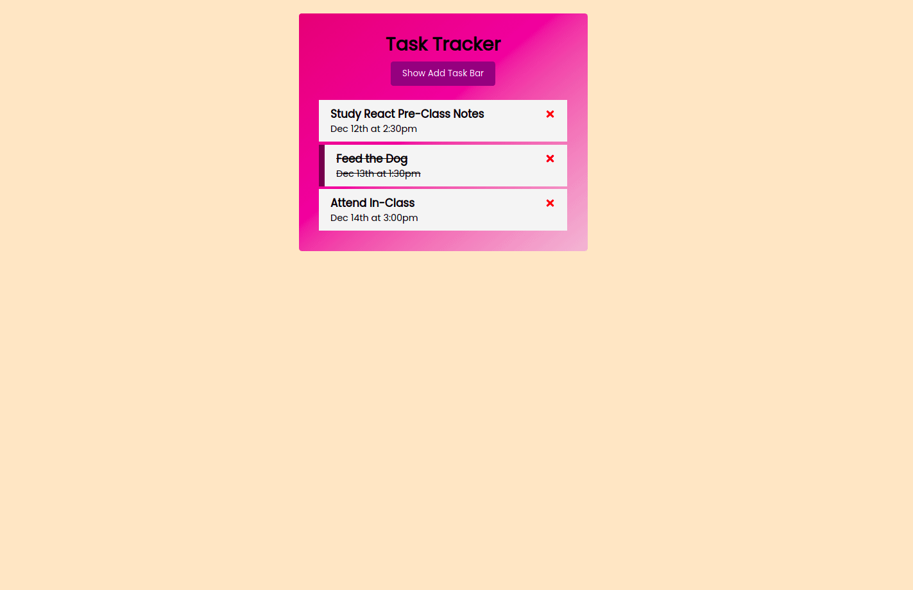

<p>Clarusway</p>

# Project-003 : Task Tracker (RP-03)

## Description

Project aims to create a Task Tracker App.

## Problem Statement

- We are adding a new project to our portfolios. So you and your colleagues have started to work on the project.

## Project Skeleton

```
 Task Tracker 
|
|----readme.md        
├── public
│     └── index.html
├── src
│    ├── components
│    │       ├── Header.js
│    │       │     └── Button.js
│    │       │   
│    │       ├── AddTask.js
│    │       │   
│    │       │   
│    │       └── Tasks.js
│    │            
│    │            
│    ├── App.js
│    ├── App.css
│    ├── index.js
│    └── index.css
├── package.json
└── yarn.lock
```

## Expected Outcome



## Skills

- HTML

- CSS

- JS

- ReactJS


